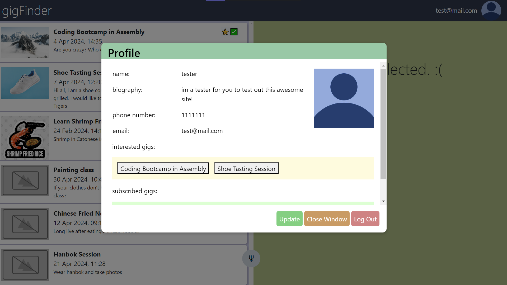
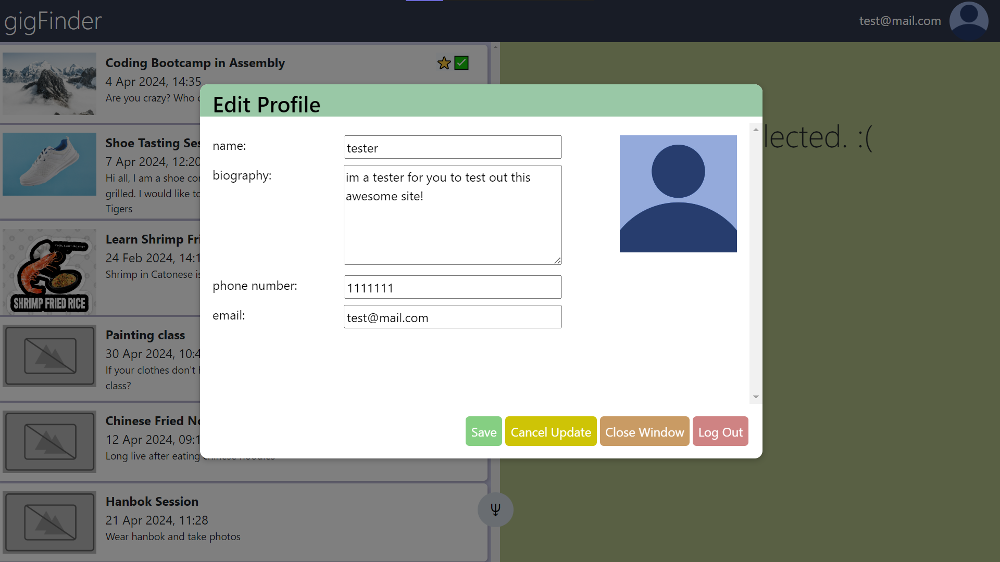
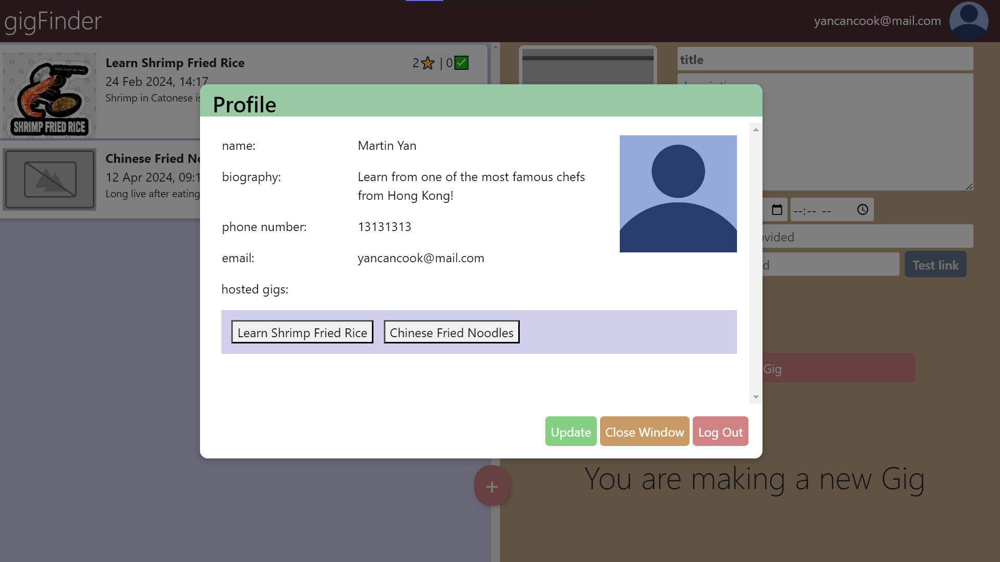
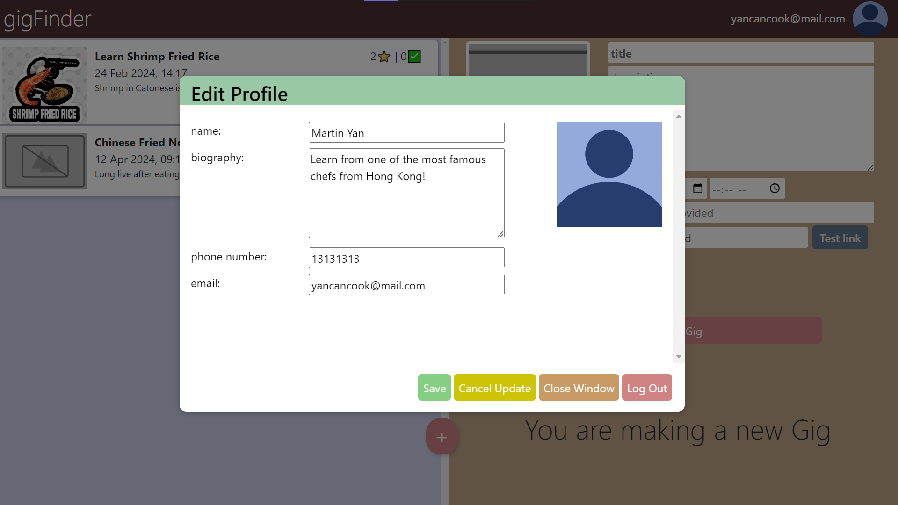

# gigFinder

## For GA SEI-49 Project 3


### Description

This web application was created as part of our project for General Assembly's Software Engineering Immersive Unit 3 - Full-Stack Development.

It allows providers to list their hosted gigs on the site for users to register interest or subscribe to the gig.

### Screenshot(s)


### Technologies Used

#### Frontend

- React
- JavaScript
- HTML
- CSS
- Bootstrap

#### Backend

- express
- nodemon
- dotenv
- bcrpt
- jsonwebtoken
- uuid
- cors
- express-rate-limit
- helmet
- express-validator
- MongoDB
- mongoose

#### APIs

- [Picture API](https://cloudinary.com)

### Getting Started

[Wireframe/proposal of app](https://docs.google.com/presentation/d/1-pWMwRm3kN_ONexkmp4uwbNtbjchvpokQJfq2NDFS5I/edit#slide=id.p)

[Public Board](https://github.com/users/kkyz13/projects/2/views/1)

Clone the repository to your local machine

```
https://github.com/kkyz13/gigFinder.git
```

Navigate to the frontend project directory

```
cd gigFinder/gigFinder_Front
```

Install the project dependencies

```
npm i
```

Set up .env for frontend

| Key         | Comment           |
| ----------- | ----------------- |
| VITE_SERVER | Port for frontend |

Navigate to the backend project directory

```
cd ..
cd gigFinder/gigServer
```

Install the project dependencies

```
npm i
```

Set up .env for backend

| Key            | Comment                       |
| -------------- | ----------------------------- |
| LOCALDB        | Local database connection URL |
| ACCESS_SECRET  | Secret key for access token   |
| REFRESH_SECRET | Secret key for refresh token  |

Run the frontend and backend

```
npm run dev
```

### How to use

#### Login/Registration:


Register as a user or provider (use the dropdown menu)


Login as a user or provider

#### User:


View user profile


Edit user profile


Click on a gig on the left, interact with it on the right

#### Provider:


View provider profile


Edit provider profile


Check out your existing gigs interests, and create/update gigs on the right

### Resources

- [Mongose docs](https://mongoosejs.com/docs/)
- [W3Schools](https://www.w3schools.com/js/)
- [Mozilla Developer Documentation](https://developer.mozilla.org/en-US/docs/Learn/Tools_and_testing/Client-side_JavaScript_frameworks/React_getting_started)
- [Bootstrap Documentation](https://getbootstrap.com/docs/5.3/getting-started/introduction/)
- [Blackbox AI for understanding and debugging useEffects](https://www.blackbox.ai)
- [Removing Outline from Forms](https://stackoverflow.com/questions/3397113/how-to-remove-focus-border-outline-around-text-input-boxes-chrome)
- [Tooltips for buttons](https://stackoverflow.com/questions/2238239/tooltips-for-button-elements)

### Planned future enhancements (icebox items)

Refer to Stretch Goals/Icebox items in [gigFinder Project Tracker](https://github.com/users/kkyz13/projects/2/views/1)
